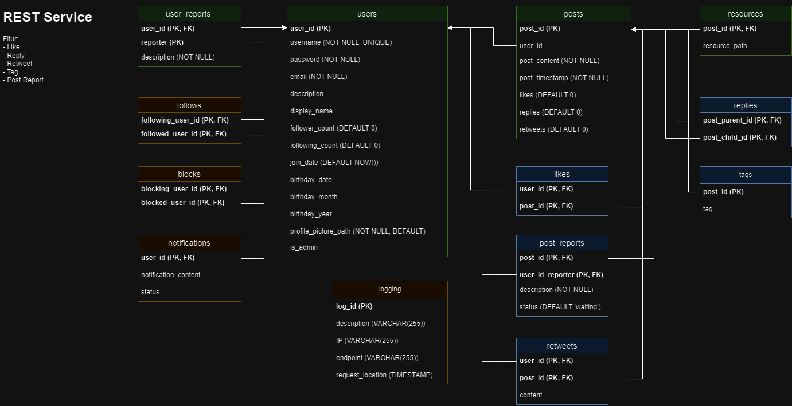

# Twitter REST Service
### Tugas Besar 2 IF3110
### Milestone 2 -  Web Services using SOAP and REST
### Kelompok 45

### Deskripsi REST Service
REST service ini menangani layanan yang diperlukan oleh _client side_ seperti memperoleh data untuk tiap halaman, membuat data baru, menghapus data yang sudah ada, dll. Service ini dibuat menggunakan bahasa NodeTS dan Express.

### Skema Basis Data

NOTE: Bagian yang terdapat pada basis data adalah entitas yang berwarna biru

### Daftar Requirement
Berikut merupakan daftar requirements untuk aplikasi:
1. npm
2. typescript
3. prisma
4. PostgreSQL
5. jwt
6. node express

### Cara Instalasi
1. Unduh requirements yang belum tersedia
2. Lakukan instalasi requirements
3. Lakukan Clone pada repository ini
4. Pada direktori ini, jalankan perintah `npm install`
5. Buat file bernama `.env`, copy isi file `.env.example` ke `.env`. Sesuaikan isinya dengan spesifikasi database yang sudah ada
6. REST Service siap dijalankan

### Cara Menjalankan Server
1. Pastikan server MySQL XAMPP dengan database yang sesuai sudah berjalan
2. Pada direktori ini, jalankan perintah `npm run dev`
3. REST Service berhasil dijalankan

### REST Service Endpoints
User Endpoints
1. GET '/user' -> untuk memperoleh data user dengan id user sebagai query parameter
2. GET '/user/current' -> untuk memperoleh data pengguna yang sedang aktif pada client saat ini
3. GET '/user/post' -> untuk memperoleh data _post_ yang telah dibuat oleh user
4. PATCH '/user' -> untuk mengubah data user yang aktif pada client saat ini
5. DELETE '/user' -> untuk menghapus akun pengguna yang sedang aktif pada client saat ini

POST Endpoints
1. GET '/post' -> untuk memperoleh data lengkap suatu post
2. POST '/post' -> untuk membuat sebuah _post_
3. GET '/post/user' -> untuk memperoleh data user pada suatu post tertentu
4. GET '/post/resources' -> untuk memperoleh media lainnya dari post seperti gambar, video, audio, dll.
5. GET '/post/replies' -> untuk memperoleh data _post_ yang merupakan reply pada _post_ lainnya
6. POST '/post/replies' -> untuk membuat _reply_ pada sebuah _post_
7. GET '/post/fyp' -> untuk memperoleh _post-post_ terbaru

Like Endpoints
1. GET '/likes' -> untuk memperoleh data banyak _like_ pada suatu _post_
2. PATCH '/likes' -> untuk menambahkan data _like_ pada suatu _post_ 
3. DELETE '/likes' -> untuk menghapus data _like_ pada suatu _post_

Follow Endpoints
1. GET '/followings' -> untuk memperoleh data pengguna yang di-_follow_ seorang pengguna
2. GET '/followers' -> untuk memperoleh data pengguna yang mem-_follow_ seorang pengguna
3. GET '/follow' -> untuk memastikan apakah pengguna saat ini mem-_follow_ seorang pengguna lainnya
4. POST '/follow' -> untuk menambahkan data _follow_ oleh pengguna saat ini yang mem-_follow_ seorang pengguna lainnya
5. DELETE '/follow' -> untuk menghapus data _follow_ oleh pengguna saat ini yang mem-_follow_ seorang pengguna lainnya

Block Endpoints
1. GET '/blocks' -> untuk memperoleh data-data pengguna yang di-_block_ oleh seorang pengguna
2. GET '/block' -> untuk memperoleh status _block_ antara pengguna saat ini dengan seorang pengguna lainnya
3. POST '/block' -> untuk menambahkan data _block_ antara pengguna saat ini dengan seorang pengguna lainnya
4. DELETE '/block' -> untuk menghapus data _block_ antara pengguna saat ini dengan seorang pengguna lainnya

Authentication Endpoints
1. POST '/login' -> untuk melakukan login dan memperoleh jwt token
2. POST '/register' -> untuk menambahkan akun baru
3. PATCH '/forgot-password' -> untuk memperbarui password sebuah akun

Post Reports Endpoints
1. GET '/post-reports' -> untuk memperoleh laporan-laporan terhadap post
2. PATCH '/post-reports/status' -> untuk memperbarui status dari laporan

User Reports Endpoints
1. GET '/user-reports' -> untuk memperoleh laporan-laporan terhadap user
2. PATCH '/user-reports/status' -> untuk memperbarui status dari laporan

### Pembagian Tugas
| NIM | Tugas |
| --- | --- |
| 13521057 | post reports endpoints, user reports endpoints, blocks endpoints, auth endpoints, beberapa user endpoints, post reply endpoints, beberapa follow endpoints |
| 13521078 | ... |
| 13521092 | ... |
